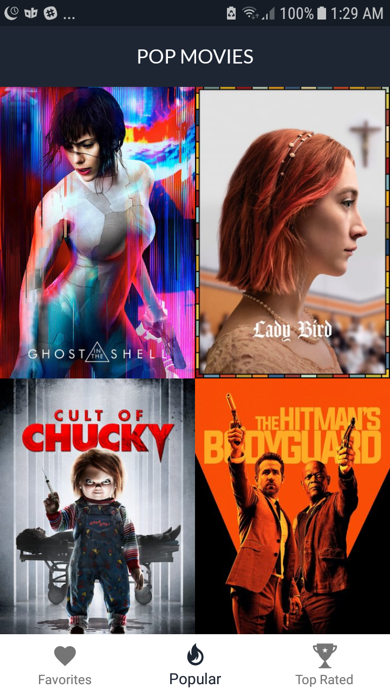
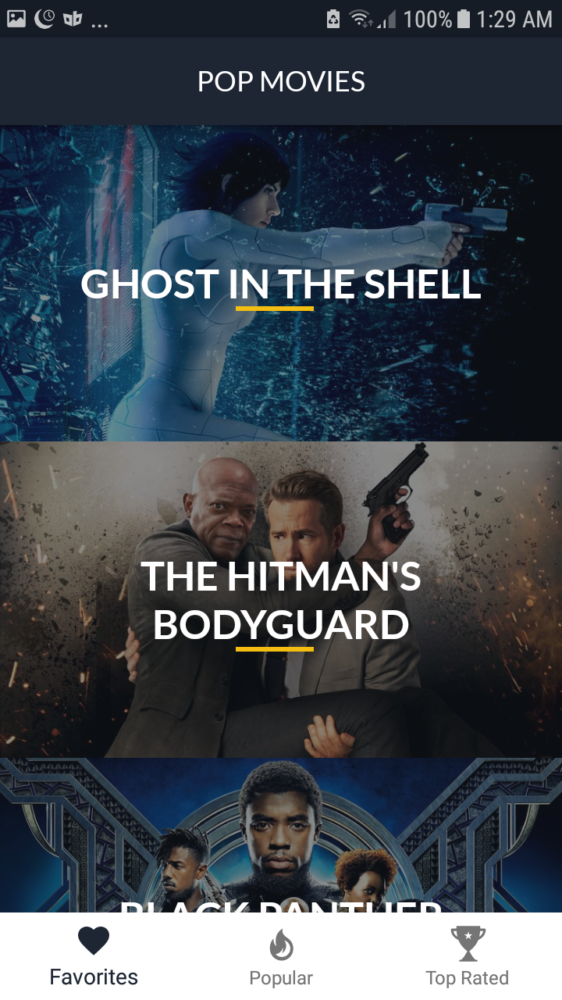
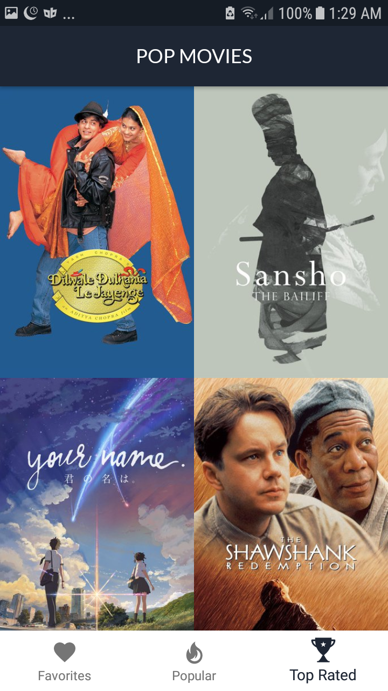
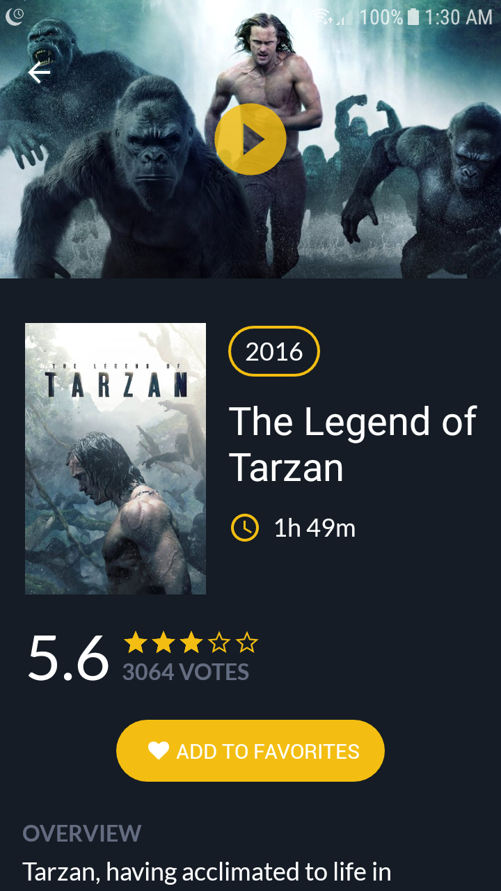
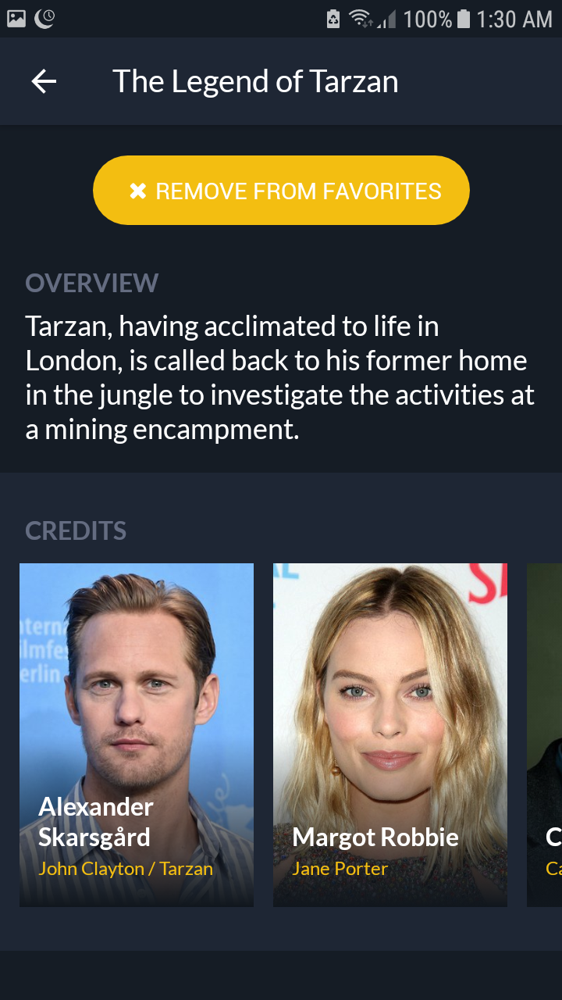
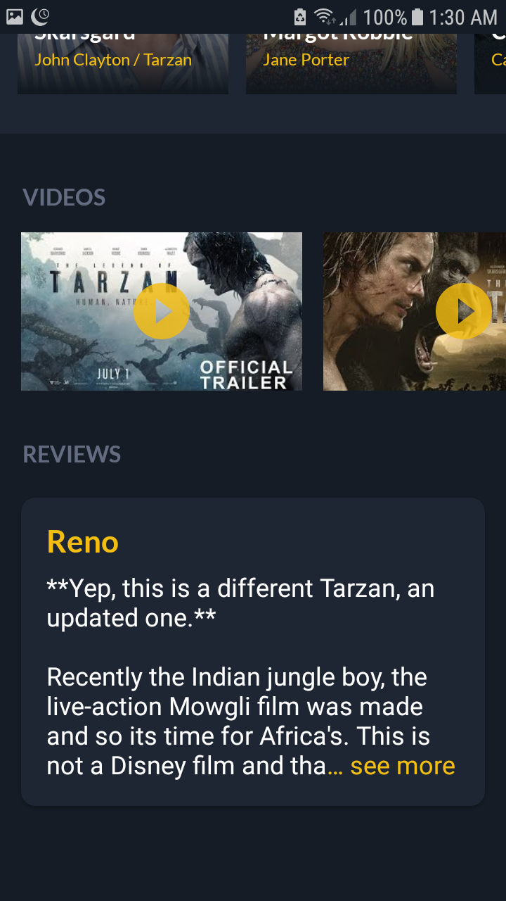
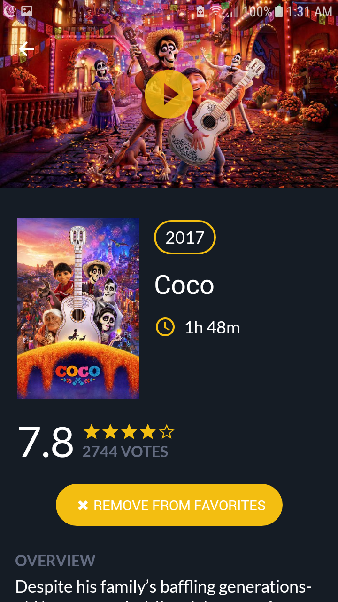

# PopularMoviesStage2
Second project for the Udacity Android Developer Nanodegree.

## Screenshots
  
  
  

## Features
MVVM + Android Architecture Component.

## Libraries and SDKs Used
- [Android Support Libraries] (https://developer.android.com/topic/libraries/support-library/packages.html) 
- [Android Architecture Components] (https://developer.android.com/topic/libraries/architecture/index.html)
- [Object Box] (http://objectbox.io/)
- [RxJava + RxAndroid] (https://github.com/ReactiveX/RxJava)
- [Dagger 2] (https://google.github.io/dagger/)
- [Retrofit] (http://square.github.io/retrofit/)
- [Gson] (https://github.com/google/gson)
- [Picasso] (http://square.github.io/picasso/)
- [Stetho] (http://facebook.github.io/stetho/)
- [Fancy Buttons] (https://github.com/medyo/Fancybuttons)
- [Material Rating Bar] (https://github.com/DreaminginCodeZH/MaterialRatingBar)
- [Material Dialogs] (https://github.com/afollestad/material-dialogs)
- [Snacky] (https://github.com/matecode/Snacky)
- [EllipsizeTextView] (https://github.com/dinuscxj/EllipsizeTextView)

## NOTES
Add this line to your gradle.properties file `API_KEY="your-movies-db-api-key"`
